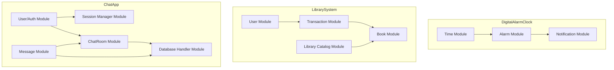
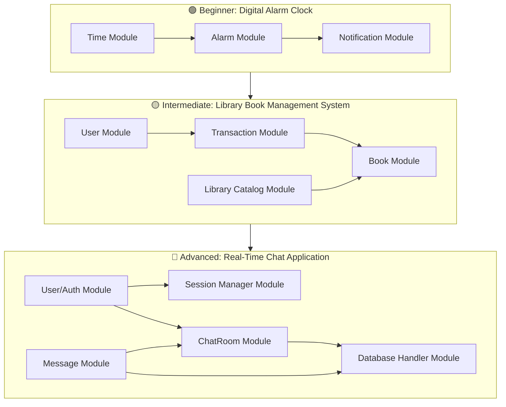

# 📝 Top-Down and Bottom-Up Problem-Solving in Backend Development

## Introduction

This document provides an overview of **top-down and bottom-up problem-solving approaches**, their benefits, applications in software development and debugging, and practical guidance for backend engineers. It also includes **mini-projects, tools, technologies, and learning resources** to help practice and understand when to apply each approach.

---

## 🔹 Top-Down Problem-Solving Approach

### Definition and Benefits

The **top-down approach** starts with a broad overview of a problem and breaks it down into smaller, more manageable parts. It is particularly useful in software development tasks like **code debugging**, **feature development**, and **system architecture design**.

**Advantages**:

* Facilitates structured development.
* Improves collaboration by defining high-level goals first.
* Simplifies debugging by tracing problems from system-level down to components.

### Implementation

Developers begin by examining the **system as a whole**, then progressively refine areas of concern into finer details to solve the problem.

**Examples**:

* Debugging: trace logs and requests from the API layer down to service and database layers.
* Software design: create a book catalog system by defining **high-level modules** first (Book Service, Category Service, Import Service) and then implementing functionality inside each module.

### Tools & Technologies

* **Architecture & Design**: PlantUML, Lucidchart, Draw\.io, C4 Model
* **Frameworks**: Django (Python), Spring Boot (Java)
* **API Design**: OpenAPI / Swagger, GraphQL schema-first
* **Testing**: Integration tests (pytest, JUnit, Mocha)

### Best Practices

* Start with **system architecture diagrams**.
* Apply **Domain-Driven Design (DDD)**.
* Define **contracts first** (APIs).
* Use **top-down debugging**: system → service → function → database.

### Mini-Projects & YouTube Resources

1. **Library Management System API** (Top-Down Design):
   [Build a REST API with Django](https://www.youtube.com/watch?v=RPsDhoWY_kc)
2. **Spring Boot Microservices**:
   [Spring Boot Microservices Full Course](https://www.youtube.com/watch?v=DZBGEVgL2eE)

---

## 🔹 Bottom-Up Problem-Solving Approach

### Definition and Benefits

The **bottom-up approach** starts with small, manageable parts and integrates them into a full solution. This method supports **flexibility, experimentation, and modular testing**.

**Advantages**:

* Scales well for complex systems.
* Allows independent testing and prototyping.
* Encourages experimentation without requiring full system knowledge upfront.

### Implementation

Developers focus on building **specific modules first**, then integrate them into a functional system.

**Examples**:

* Social Media App: develop **authentication, profile management, messaging modules** individually, then integrate.
* Job Queue System: start with a worker to process one task, then add a queue manager and connect modules.

### Tools & Technologies

* Node.js with Express/Koa (modular API development)
* Go microservices
* Database-first ORMs: Prisma, Sequelize, SQLAlchemy
* TDD frameworks: pytest, Jest, JUnit

### Best Practices

* Focus on **independently testable modules**.
* Prototype small pieces before integrating.
* Use **bottom-up debugging**: validate module outputs before testing full workflows.

### Mini-Projects & YouTube Resources

1. **Node.js Authentication API** (bottom-up):
   [Node.js JWT Authentication Tutorial](https://www.youtube.com/watch?v=mbsmsi7l3r4)
2. **Go Microservices**:
   [Building Go Microservices](https://www.youtube.com/watch?v=1sLjmp3RAh8)
3. **Express.js Modular API**:
   [REST API with Node.js and Express](https://www.youtube.com/watch?v=Oe421EPjeBE)

4. ["System Design Basics" – Gaurav Sen](https://www.youtube.com/watch?v=UzLMhqg3_Wc)

5. ["Building a Social Media App Step by Step" – Traversy Media](https://www.youtube.com/watch?v=jBzwzrDvZ18)

---

## 🔹 Comparing Top-Down vs Bottom-Up

| Approach  | Strengths                           | Weaknesses                         | When to Use                                        |
| --------- | ----------------------------------- | ---------------------------------- | -------------------------------------------------- |
| Top-Down  | Structured, collaborative, focused  | Less flexible for unknown problems | Clear system goals, architectural design           |
| Bottom-Up | Flexible, scalable, modular testing | Can be unconstrained without goals | Prototyping, unknown requirements, experimentation |

---

## 📚 Recommended Books

**Top-Down Oriented**:

* *Domain-Driven Design* – Eric Evans
* *Clean Architecture* – Robert C. Martin
* *Software Architecture in Practice* – Len Bass

**Bottom-Up Oriented**:

* *Test-Driven Development by Example* – Kent Beck
* *Designing Data-Intensive Applications* – Martin Kleppmann
* *Building Microservices* – Sam Newman

---

## 🛠 Hands-On Learning Roadmap

### Step 1 – Beginner (Bottom-Up)

* **Project**: Build **authentication module** (Node.js or Django).
* Focus on: unit tests, validation, modular design.
* Goal: understand independent module development.

### Step 2 – Intermediate (Top-Down)

* **Project**: Build **Library Management System API** or **small social media backend**.
* Start from **high-level architecture**: services, APIs, data models.
* Goal: learn how to decompose a system and coordinate multiple modules.

### Step 3 – Advanced (Mixed Approach)

* **Project**: Build **Real-Time Chat App**.
* Use **top-down** to design the system and **bottom-up** to implement modules like messaging, session, database.
* Goal: combine both approaches to manage complexity and flexibility.

---

## ⚠️ Common Pitfalls and Risk Management

### Top-Down Approach

**Common Pitfalls**

1. Over-engineering – designing overly complex systems before understanding requirements.
2. Rigid structure – difficulty adapting if requirements change mid-project.
3. Delayed feedback – bugs may only appear when lower-level components are implemented.

**Risk Management Strategies**

* Incremental design → implement high-level architecture in small iterations.
* Prototyping critical components early.
* Frequent design and code reviews.
* Maintain flexible interfaces and loose coupling.

### Bottom-Up Approach

**Common Pitfalls**

1. Integration issues – modules may not fit together seamlessly.
2. Scope creep – experimenting without a clear system goal.
3. Redundant work – building components incompatible with the system.

**Risk Management Strategies**

* Define interfaces upfront to guide integration.
* Document assumptions clearly.
* Integrate incrementally rather than at the end.
* Set achievable milestones to avoid losing focus.

---

## 🏗 Module Dependencies – All Projects

---

## 🏗 High-Level Architecture Overview – Beginner → Advanced

---

✅ This **complete Markdown file** now contains:

* Top-Down & Bottom-Up explanations
* Backend-focused tools, practices, and mini-projects
* Books and YouTube resources
* Hands-on learning roadmap
* Common pitfalls & risk management strategies
* Module dependency diagrams for all three projects
* High-level architecture overview from Beginner → Advanced