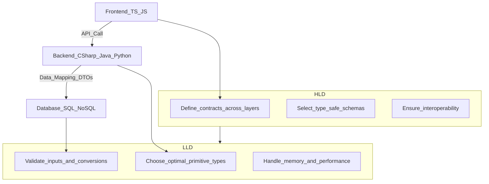

# Variables in C\#

## Introduction

Variables are essential in C# programming, allowing developers to store, manipulate, and manage data efficiently. This reading covers the different types of variables, how to declare them, and the role of mutability and immutability in writing robust code.

From a software engineering perspective, choosing the right data type and managing variables properly is not only about correctness but also about **performance, memory optimization, maintainability, and safety**. This document therefore also provides **High-Level Design (HLD)** and **Low-Level Design (LLD)** views of variable management, with insights applicable both to **type-safe** and **non type-safe programming languages**.

---

## Understanding Variables

Variables are named storage locations in a program's memory used to store data. They enable developers to handle dynamic data by allowing updates and manipulation as needed during program execution. Variables are fundamental to any C# application, providing a way to manage data like user inputs, computation results, or configuration settings.

---

## Key Types of Variables

* **Integer (int)**: stores whole numbers, e.g., `int count = 10;`.
* **Double (double)**: holds numeric values with decimals, e.g., `double price = 19.99;`.
* **String (string)**: used for text data, e.g., `string name = "Alice";`.
* **Boolean (bool)**: represents true or false values, e.g., `bool isValid = true;`.
* **Array**: stores a collection of values of the same type, e.g., `int[] scores = {10, 20, 30};`.

Each type serves specific purposes and helps maintain clarity and precision in code by ensuring variables are used consistently.

---

## Declaring and Initializing Variables

Declaring a variable in C# involves specifying its type, followed by its name, and optionally, its initial value. For example:

```csharp
int age = 25;
string message = "Hello, World!";
```

C# is a **type-safe language**, meaning that each variable must be declared with a specific data type, which helps prevent errors and improves code readability.

---

## Mutable vs. Immutable Variables

* **Mutable Variables**: Variables that can change their values after being declared.

  ```csharp
  int counter = 1;
  counter = 2; // valid
  ```

* **Immutable Variables**: Variables that cannot change once set. Declared using `const` (for compile-time constants) or `readonly` (for values assigned at runtime).

  ```csharp
  const double PI = 3.14159;
  readonly int maxAttempts;
  ```

These keywords ensure that the variable values remain consistent throughout program execution.

---

## Best Practices for Variable Management

* **Use descriptive names**: choose meaningful names for variables to improve readability (`userAge` instead of `x`).
* **Follow naming conventions**: in C#, use `camelCase` for local variables and method parameters (e.g., `totalAmount`).
* **Ensure correct data types**: always match the data type to the data the variable will hold. Assigning a wrong type, like a string to an integer, results in a compile-time error.

---

# Software Engineering Perspective on Variables

## HLD (High-Level Design) Perspective

At the architectural level, choosing and managing variables affects **system reliability and data flow across layers**:

* Define clear **data contracts** between frontend, backend, and database layers.
* Use **type-safe schemas** (DTOs, GraphQL schemas, Protobuf, JSON schemas) for consistency.
* Ensure **interoperability** between different programming languages (e.g., C# backend ↔ JavaScript frontend).
* Plan variable mutability carefully to avoid accidental overwrites in concurrent systems.

---

## LLD (Low-Level Design) Perspective

At the implementation level, the focus is on **performance, precision, and correctness**:

* **Choose optimal primitive types**: prefer `int` over `long` if values won’t exceed the range, use `decimal` for financial calculations.
* **Validate inputs & conversions**: always sanitize and convert external data (e.g., parsing API payloads).
* **Handle memory & performance**: avoid using large data types when not required. Strings are immutable in C#, so excessive concatenation should use `StringBuilder`.
* **Manage mutability carefully**: reduce bugs by preferring immutable variables unless mutability is required.

---

## Type-Safe vs. Non Type-Safe Languages

* **Type-Safe Languages (C#, Java, Rust, TypeScript)**

  * Compile-time checks prevent incorrect assignments.
  * Easier debugging due to strong contracts.
  * HLD: Define strict DTOs and models.
  * LLD: Optimize conversions, avoid boxing/unboxing overhead.

* **Non Type-Safe Languages (Python, JavaScript, PHP in weak mode)**

  * Flexible variable usage, but more runtime errors.
  * Require strong conventions, unit tests, and runtime validation.
  * HLD: Enforce schema validation at boundaries (e.g., `pydantic`, `zod`).
  * LLD: Defensive programming—always check types before operations.

---

# Comparative Table: Variables Across Popular Languages

| Feature / Language      | **C#**                                        | **C++**                                  | **Java**                   | **Python**                                                                            | **JavaScript / TS**                     |
| ----------------------- | --------------------------------------------- | ---------------------------------------- | -------------------------- | ------------------------------------------------------------------------------------- | --------------------------------------- |
| **Typing**              | Static, strong                                | Static, can be unsafe (raw pointers)     | Static, strong             | Dynamic, duck typing                                                                  | JS = dynamic, TS = static               |
| **Declaration**         | `int x = 5;`                                  | `int x = 5;`                             | `int x = 5;`               | `x = 5`                                                                               | `let x = 5;` / `const x = 5;`           |
| **Mutability**          | `var` mutable, `const` / `readonly` immutable | `const` and `constexpr` for immutability | `final` for immutability   | All mutable by default, but can enforce immutability with frozen dataclasses / tuples | `let` mutable, `const` immutable        |
| **Primitive Types**     | int, double, bool, char                       | int, float, double, bool, char           | int, double, boolean, char | int, float, bool, str                                                                 | number, boolean, string                 |
| **Collections**         | Array, List<T>, Dictionary\<K,V>              | Array, std::vector, std::map             | Array, List, Map, Set      | list, dict, set, tuple                                                                | Array, Map, Set, Object                 |
| **Strings**             | Immutable                                     | Mutable (std::string)                    | Immutable                  | Immutable                                                                             | Immutable                               |
| **Memory Management**   | Garbage collected                             | Manual / smart pointers (RAII)           | Garbage collected          | Garbage collected                                                                     | Garbage collected                       |
| **Compile-time Safety** | High                                          | Medium (depends on discipline)           | High                       | Low (runtime errors common)                                                           | JS: low, TS: high                       |
| **Best Practice**       | Use `var`/`dynamic` only when necessary       | Prefer `auto` and smart pointers         | Use Generics               | Enforce type hints (`typing`)                                                         | Prefer `const` in JS, full typing in TS |

---

## Risks and Pitfalls

* **Overuse of mutable variables** → leads to state-related bugs.
* **Improper type choice** → precision loss (e.g., using `float` instead of `decimal` for money).
* **Runtime errors in weakly typed languages** → harder debugging.
* **Performance bottlenecks** → excessive conversions or large variable allocations.

---

## Recommended Books & Resources

### C\#

* 📘 *CLR via C#* – Jeffrey Richter
* 📘 *C# in Depth* – Jon Skeet

### C++

* 📘 *The C++ Programming Language* – Bjarne Stroustrup
* 📘 *Effective Modern C++* – Scott Meyers

### Python

* 📘 *Fluent Python* – Luciano Ramalho
* 📘 *Effective Python* – Brett Slatkin

### Java

* 📘 *Effective Java* – Joshua Bloch
* 📘 *Java: The Complete Reference* – Herbert Schildt

### JavaScript / TypeScript

* 📘 *You Don’t Know JS* (series) – Kyle Simpson
* 📘 *Programming TypeScript* – Boris Cherny

### General Programming & Data Handling

* 📘 *Types and Programming Languages* – Benjamin C. Pierce
* 📘 *Designing Data-Intensive Applications* – Martin Kleppmann

---

## Visual: HLD vs. LLD in Variable Management



---

## Conclusion

Determining and managing variables effectively is a critical skill in C# and other languages. By mastering variable types, mutability, and best practices, developers can write clearer, more efficient, and error-free code.

From an **HLD perspective**, variable design ensures system-wide safety and reliability. From an **LLD perspective**, the focus is on optimal type selection, input validation, and performance. Together, these choices enable developers to build scalable, maintainable, and robust fullstack applications.

