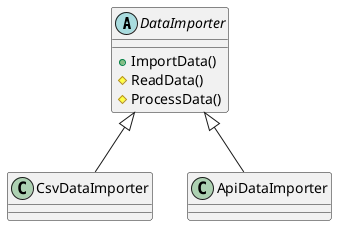
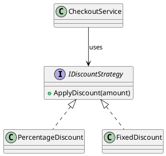
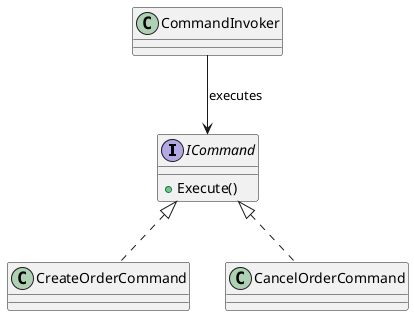
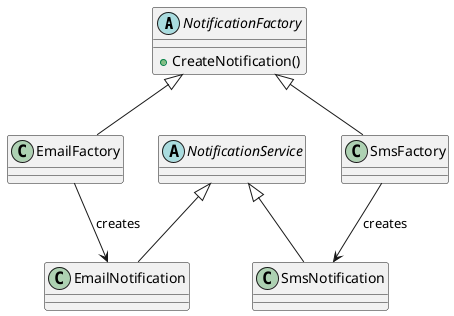
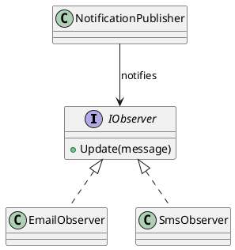
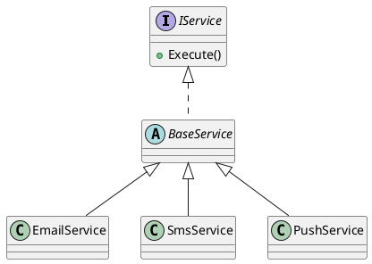

# **Inheritance and Polymorphism in C#: Extending Behavior and Designing for Flexibility**

## **Introduction**

Inheritance and polymorphism are two of the most powerful and misunderstood concepts in Object-Oriented Programming (OOP).
In C#, they form the backbone of code **reusability**, **modularity**, and **extensibility** — essential traits for building scalable backend systems and distributed applications.

This reading explores:

* How inheritance enables developers to **reuse and extend code**.
* How polymorphism makes software **flexible and adaptable**.
* How these principles are applied effectively in **modern C# backend architectures**.

---

## **1. Understanding Inheritance**

### **The Concept**

Inheritance allows a class (called a *derived* or *child* class) to acquire the fields, properties, and methods of another class (called a *base* or *parent* class).
It’s like forming a “family tree” of types, where shared functionality lives at higher levels, and specialized behavior appears lower down.

```csharp
public class Bird
{
    public void Fly() => Console.WriteLine("Flying...");
}

public class Eagle : Bird
{
    public void Hunt() => Console.WriteLine("Hunting for prey...");
}

public class Parrot : Bird
{
    public void Speak() => Console.WriteLine("Speaking...");
}
```

Both `Eagle` and `Parrot` inherit the `Fly()` method from `Bird`, but each adds unique behavior.

---

## **2. Benefits of Inheritance**

| Benefit                 | Description                                                                               |
| ----------------------- | ----------------------------------------------------------------------------------------- |
| **Code Reusability**    | Common behaviors are defined once in a base class and reused by multiple derived classes. |
| **Reduced Redundancy**  | Avoids duplicating code across related components.                                        |
| **Logical Hierarchy**   | Organizes code into meaningful, domain-aligned relationships.                             |
| **Centralized Updates** | Fixes or enhancements in the base class automatically propagate to subclasses.            |

```csharp
public abstract class BaseEntity
{
    public int Id { get; set; }
    public DateTime CreatedAt { get; set; } = DateTime.UtcNow;
}

public class Customer : BaseEntity
{
    public string Name { get; set; } = string.Empty;
}

public class Order : BaseEntity
{
    public decimal TotalAmount { get; set; }
}
```

Here, `Customer` and `Order` both inherit common fields like `Id` and `CreatedAt`, which are often used across backend entities.

---

## **3. Extending Functionality Through Inheritance**

Derived classes can **extend** or **override** base class behavior using the `virtual`, `override`, and `sealed` keywords.

```csharp
public class Payment
{
    public virtual void Process() => Console.WriteLine("Processing generic payment...");
}

public class CreditCardPayment : Payment
{
    public override void Process() => Console.WriteLine("Processing credit card payment...");
}

public class PixPayment : Payment
{
    public override void Process() => Console.WriteLine("Processing PIX transfer...");
}
```

This pattern is common in **payment gateways, notification services, and data processing pipelines**.

---

## **4. Polymorphism: Designing for Flexibility**

Polymorphism allows objects of different types to be treated as objects of a common base type — enabling generic, extensible designs.

### **Compile-Time Polymorphism (Static)**

* Achieved via **method overloading** (same method name, different parameters).
* Decided at compile time.

```csharp
public class Logger
{
    public void Log(string message) => Console.WriteLine(message);
    public void Log(string message, Exception ex) => Console.WriteLine($"{message}: {ex.Message}");
}
```

### **Runtime Polymorphism (Dynamic)**

* Achieved through **method overriding** using `virtual` and `override`.
* Decided at runtime.

```csharp
Payment payment = new CreditCardPayment();
payment.Process(); // Output: Processing credit card payment...
```

---

## **5. Why Polymorphism Matters in Backend Development**

Polymorphism is essential for writing **extensible**, **maintainable**, and **testable** code.

```csharp
public abstract class NotificationService
{
    public abstract Task SendAsync(string recipient, string message);
}

public class EmailNotification : NotificationService
{
    public override Task SendAsync(string recipient, string message)
    {
        Console.WriteLine($"Email to {recipient}: {message}");
        return Task.CompletedTask;
    }
}

public class SmsNotification : NotificationService
{
    public override Task SendAsync(string recipient, string message)
    {
        Console.WriteLine($"SMS to {recipient}: {message}");
        return Task.CompletedTask;
    }
}
```

Adding a new notification type, such as `PushNotification`, does not require changing existing code — demonstrating extensibility through polymorphism.

---

## **6. Combining Inheritance and Polymorphism in Distributed Systems**

| Concept                  | Example in Distributed Systems                                 |
| ------------------------ | -------------------------------------------------------------- |
| **Inheritance**          | Shared `BaseController` defines logging and validation.        |
| **Polymorphism**         | Services handle different message types via shared interfaces. |
| **Dependency Injection** | ASP.NET Core injects appropriate implementations at runtime.   |

---

## **7. Avoiding Common Inheritance Pitfalls**

**Best Practices:**

1. **Favor Composition over Inheritance**
2. **Keep Hierarchies Shallow**
3. **Avoid God Base Classes**
4. **Use Sealed Classes Carefully**
5. **Combine with Interfaces and Dependency Injection**

---

## **8. Polymorphism in Action: Real-World Use Cases**

| Use Case               | Description                                                                                 |
| ---------------------- | ------------------------------------------------------------------------------------------- |
| **Data Access Layers** | Repositories share a base interface but have specific implementations (e.g., SQL, MongoDB). |
| **Messaging Systems**  | Handlers inherit from a base handler and process events differently.                        |
| **Payment Processing** | Each payment type overrides a `Process()` method.                                           |
| **Logging Providers**  | Swap logging frameworks without changing business logic.                                    |

---

## **9. Summary of Key C# Keywords**

| Keyword      | Purpose                                                 |
| ------------ | ------------------------------------------------------- |
| **base**     | Accesses the base class from a derived class.           |
| **virtual**  | Marks a method as overridable.                          |
| **override** | Replaces base class implementation.                     |
| **sealed**   | Prevents further inheritance.                           |
| **abstract** | Defines methods that must be implemented by subclasses. |

---

## **10. Conclusion**

Inheritance and polymorphism are not just tools for structuring code — they are **architectural enablers**.
Used thoughtfully, they promote **reuse**, **extensibility**, and **adaptability**, critical traits of production-grade C# backends.

> **Inheritance organizes your design; polymorphism keeps it alive.**

---

## **11. Inheritance and Polymorphism in Design Patterns**

Design patterns operationalize inheritance and polymorphism to solve recurring design problems.

### **Template Method Pattern**



### **Strategy Pattern**



### **Command Pattern**



### **Factory Method Pattern**



### **Observer Pattern**



### **Polymorphism Hierarchy Overview**



---

## **12. Conclusion**

UML diagrams make the power of inheritance and polymorphism **visible**.
They show how structure (inheritance) and behavior (polymorphism) come together to form the core of design patterns.

> **Inheritance builds the skeleton; polymorphism makes it move.**
