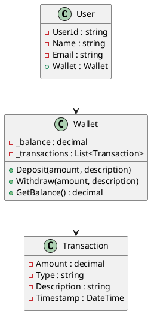
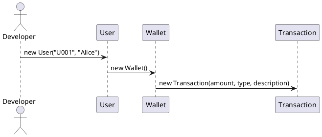
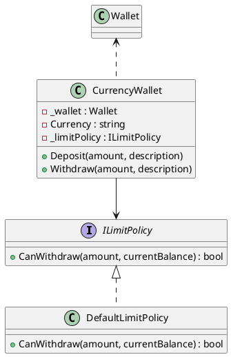
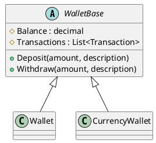
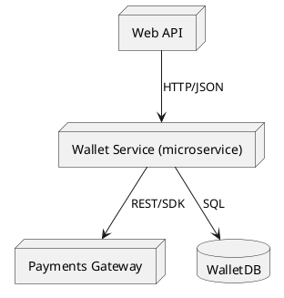
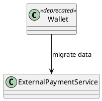

# **Working with Classes and Objects: Full Example Through the Software Development Life Cycle (SDLC)**

## **Scenario Overview: Fintech Application (Digital Wallet Service)**

We’ll explore the complete life cycle of working with classes and objects in a **Fintech digital wallet** application. The system allows users to register, load money, make payments, and view transaction history.

This example will walk through the **Software Development Life Cycle (SDLC)** stages — from requirements gathering to class retirement — highlighting how class design evolves with business needs. The document now includes **PlantUML diagrams** and **real C# code snippets** for each relevant topic.

---

## **1. Requirements Gathering and Domain Analysis**

At this stage, the goal is to **understand the problem domain** and define real-world entities that the system must model.

### **Functional Requirements:**

* Users can create accounts (digital wallets).
* Users can deposit and withdraw funds.
* Transactions must be logged with timestamps and descriptions.
* The system must support integration with payment gateways.

### **Non-Functional Requirements:**

* Secure user data handling.
* Scalability for multiple users.
* Maintainability and ease of adding new payment types.

### **Domain Analysis:**

We identify the key entities:

* **User** → represents wallet owners.
* **Wallet** → manages the balance and transactions.
* **Transaction** → records operations (deposit, withdrawal, transfer).

These become the initial class candidates.

**Pitfall if ignored:** Skipping this stage leads to vague class boundaries, duplicated responsibilities, and brittle architecture.

---

## **2. System Design and Class Modeling**

Next, we model our domain entities into classes and provide concrete C# implementations for the initial design.

### **2.1 Initial Class Diagram (Conceptual)**



The UML above represents our initial concept: each `User` owns a `Wallet`, which manages `Transactions`.

### **2.2 initial implementation (Transaction, Wallet, User)**

```csharp
// Transaction.cs
public class Transaction
{
    public decimal Amount { get; }
    public string Type { get; }
    public string Description { get; }
    public DateTime Timestamp { get; }

    public Transaction(decimal amount, string type, string description)
    {
        Amount = amount;
        Type = type;
        Description = description;
        Timestamp = DateTime.UtcNow;
    }
}

// Wallet.cs
public class Wallet
{
    private decimal _balance;
    private readonly List<Transaction> _transactions = new List<Transaction>();

    public Wallet(decimal initialBalance = 0m)
    {
        _balance = initialBalance;
    }

    public void Deposit(decimal amount, string description)
    {
        if (amount <= 0) throw new ArgumentException("Deposit must be positive");
        _balance += amount;
        _transactions.Add(new Transaction(amount, "Deposit", description));
    }

    public void Withdraw(decimal amount, string description)
    {
        if (amount <= 0) throw new ArgumentException("Withdrawal must be positive");
        if (amount > _balance) throw new InvalidOperationException("Insufficient funds");
        _balance -= amount;
        _transactions.Add(new Transaction(amount, "Withdrawal", description));
    }

    public decimal GetBalance() => _balance;

    public IReadOnlyList<Transaction> Transactions => _transactions.AsReadOnly();
}

// User.cs
public class User
{
    public string UserId { get; }
    public string Name { get; }
    public Wallet Wallet { get; }

    public User(string userId, string name)
    {
        UserId = userId;
        Name = name;
        Wallet = new Wallet();
    }
}
```

**Design Decisions:**

* **Composition over inheritance**: The `User` *has a* `Wallet`, not *is a* `Wallet`.
* **Encapsulation**: Balance updates go through methods to ensure validation.
* **Transaction immutability**: Transactions are read-only after creation.

---

## **3. Implementation and Instantiation**

When coding, you **instantiate** these classes to create real-world objects. Below is a runtime sequence (PlantUML) and real example of usage.



```csharp
// Program.cs (usage)
public static class Program
{
    static void Main()
    {
        var user = new User("U001", "Alice");
        user.Wallet.Deposit(200m, "Initial load");
        user.Wallet.Withdraw(50m, "Purchase at Store A");
        Console.WriteLine($"User: {user.Name}, Balance: {user.Wallet.GetBalance()}");
    }
}
```

---

## **4. Expansion: Introducing New Features**

**Requirement:** Add support for multiple currency wallets and transaction limits.

We now need to extend `Wallet` functionality. The design below uses **composition** and the **Strategy** pattern for limit policies, with class and code examples.



```csharp
// ILimitPolicy.cs
public interface ILimitPolicy
{
    bool CanWithdraw(decimal amount, decimal currentBalance);
}

// DefaultLimitPolicy.cs
public class DefaultLimitPolicy : ILimitPolicy
{
    public bool CanWithdraw(decimal amount, decimal currentBalance) => currentBalance >= amount;
}

// CurrencyWallet.cs
public class CurrencyWallet
{
    private readonly Wallet _wallet;
    public string Currency { get; }
    private readonly ILimitPolicy _limitPolicy;

    public CurrencyWallet(string currency, ILimitPolicy limitPolicy)
    {
        Currency = currency;
        _wallet = new Wallet();
        _limitPolicy = limitPolicy;
    }

    public void Deposit(decimal amount, string description) => _wallet.Deposit(amount, description);

    public void Withdraw(decimal amount, string description)
    {
        if (!_limitPolicy.CanWithdraw(amount, _wallet.GetBalance()))
            throw new InvalidOperationException("Withdrawal not permitted by policy");
        _wallet.Withdraw(amount, description);
    }

    public decimal GetBalance() => _wallet.GetBalance();
}
```

**Strength:** The class is now extensible — new policies (like VIP limits) can be added without changing `CurrencyWallet`.

---

## **5. Maintenance and Refactoring**

As the product grows, developers may notice **code smells** like duplication or God Classes. The refactor below demonstrates extracting shared functionality into `WalletBase`.



```csharp
// WalletBase.cs
public abstract class WalletBase
{
    protected decimal Balance;
    protected readonly List<Transaction> Transactions = new List<Transaction>();

    public virtual void Deposit(decimal amount, string description)
    {
        if (amount <= 0) throw new ArgumentException("Amount must be positive");
        Balance += amount;
        Transactions.Add(new Transaction(amount, "Deposit", description));
    }

    public virtual void Withdraw(decimal amount, string description)
    {
        if (amount <= Balance) throw new InvalidOperationException("Insufficient funds");
        Balance -= amount;
        Transactions.Add(new Transaction(amount, "Withdrawal", description));
    }

    public decimal GetBalance() => Balance;
}

// Wallet and CurrencyWallet can now inherit from WalletBase
```

**Note:** the refactor above should be accompanied by unit tests to ensure behavior preserved; mistakes in refactoring can introduce bugs.

---

## **6. Deployment & Migration: Moving to Microservices**

When the system grows the architecture may evolve to microservices. Below is a PlantUML component/deployment view and a migration snippet.



```csharp
// Migration helper (simplified pseudocode)
public class WalletMigration
{
    public void MigrateOldWallet(Wallet oldWallet)
    {
        // Map transactions and balances to new service request
        var request = new CreateAccountRequest { Balance = oldWallet.GetBalance(), Transactions = oldWallet.Transactions };
        NewWalletServiceClient.CreateAccount(request);
    }
}
```

---

## **7. Retirement and Decommissioning**

When moving to a **microservice architecture**, legacy classes such as `Wallet` may be replaced with external payment APIs. Use a phased approach (Strangler Fig) and mark old code as deprecated.



```csharp
[Obsolete("Legacy Wallet replaced by ExternalPaymentService integration")]
public class Wallet { /* old implementation */ }
```

---

## **8. Full Example: Project File Structure and Real Code Snapshot**

**Suggested project layout**

```
src/
  Fintech.Wallet/
    Models/
      Transaction.cs
      User.cs
    Services/
      WalletService.cs
      Migration/WalletMigration.cs
    Policies/
      ILimitPolicy.cs
      DefaultLimitPolicy.cs
    Program.cs
```

**Program.cs (entry usage)**

```csharp
public static class Program
{
    static void Main()
    {
        var user = new User("U001", "Alice");
        user.Wallet.Deposit(200m, "Initial load");
        user.Wallet.Withdraw(50m, "Purchase at Store A");
        Console.WriteLine($"User: {user.Name}, Balance: {user.Wallet.GetBalance()}");

        // Example migration call (when decommissioning)
        var migrator = new WalletMigration();
        migrator.MigrateOldWallet(user.Wallet);
    }
}
```

---

## **9. Lessons Learned**

| SDLC Stage         | Key Class-Design Takeaway            | Risk if Ignored                     |
| ------------------ | ------------------------------------ | ----------------------------------- |
| **Requirements**   | Understand the domain before coding  | Ambiguous models, brittle code      |
| **Design**         | Apply SRP and encapsulation          | Classes with mixed responsibilities |
| **Implementation** | Validate state transitions           | Hidden data corruption              |
| **Testing**        | Test class behavior in isolation     | Undetected regressions              |
| **Expansion**      | Extend via composition or interfaces | Inflexible architecture             |
| **Maintenance**    | Refactor periodically                | Code rot and tech debt              |
| **Retirement**     | Deprecate gradually and document     | System instability                  |

---

## **Conclusion**

This document illustrate how classes evolve across the SDLC for a fintech digital wallet. Use the diagrams to communicate design decisions with stakeholders and the code snippets as a practical starting point for implementation.
