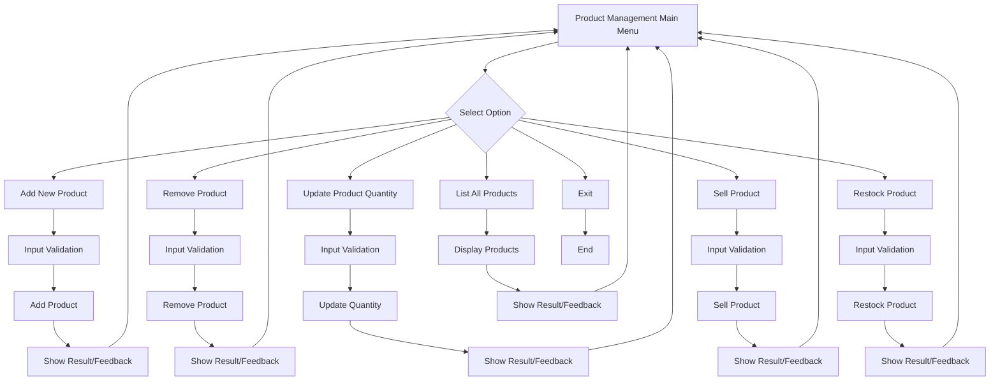

# C# Console Application for Final Quiz

This is a starter C# console application. Use this as a base for your C# code in the `final-quiz` folder.

## How to Build and Run

1. Make sure you have the .NET SDK installed (https://dotnet.microsoft.com/download)
2. Open a terminal in this folder.
3. Run the following commands:

```
dotnet build
```

To run the application:

```
dotnet run
```

## Project Structure
- `Program.cs`: Main entry point for your application.
- `final-quiz.csproj`: Project file for .NET.

---

## Project Objectives

This project implements a simple C# console-based Product Management System. The main objectives are:

- Provide a basic inventory management tool for adding, removing, listing, selling, and restocking products.
- Demonstrate core C# programming concepts such as classes, methods, enums, collections, and user input handling.
- Serve as a learning exercise for system design, error handling, and user experience improvements in a command-line application.

## Functional Requirements

- **Add Product:** Users can add new products with a name, price, and quantity. Duplicate product names are not allowed.
- **Remove Product:** Users can remove products by name.
- **List Products:** Users can view all products with their name, price, and quantity, formatted with a dot as the decimal separator.
- **Update Quantity:** Users can update the quantity of an existing product.
- **Sell Product:** Users can sell a specified quantity of a product, reducing its stock. The system prevents selling more than is available or negative quantities.
- **Restock Product:** Users can increase the stock of a product. Negative restock values are not allowed.
- **Input Validation:** All numeric inputs (price, quantity) are validated and parsed using invariant culture to ensure consistent decimal handling.
- **Result Feedback:** All actions provide clear feedback using enums for success, not found, already exists, or low stock situations.

## Non-Functional Requirements

- **Usability:** The system provides clear prompts and error messages to guide the user through all operations.
- **Robustness:** The application handles invalid input gracefully and prevents invalid operations (e.g., negative stock, duplicate products).
- **Maintainability:** The code is well-commented, modular, and easy to extend or refactor.
- **Portability:** The application runs on any system with .NET 8.0+ and does not depend on external libraries.
- **Locale Independence:** All decimal values use a dot as the separator, regardless of system locale, for consistent behavior.

---

## Design Outline

### Application Flowchart (Mermaid)



### Task Breakdown and Code Components

| Task                        | Code Component(s)         | Variables/Methods/Structures Used                |
|-----------------------------|---------------------------|-------------------------------------------------|
| Add New Product             | Inventory.AddNewProduct   | name, price, quantity, ProductActionResult enum  |
| Remove Product              | Inventory.RemoveProduct   | name, ProductActionResult enum                   |
| List All Products           | Inventory.ListAllProducts | products_name, products_price, products_quantity |
| Update Product Quantity     | Inventory (private method)| UpdateQuantity (reflection), ProductActionResult |
| Sell Product                | Inventory.SellProduct     | name, quantity, ProductActionResult enum         |
| Restock Product             | Inventory.RestockProduct  | name, quantity, ProductActionResult enum         |
| Input Validation            | Program.Main              | float.TryParse, CultureInfo.InvariantCulture     |
| Result Feedback             | Program.Main, Inventory   | Console.WriteLine, ProductActionResult enum      |
| Loop/Menu Control           | Program.Main              | while(true), switch/case                        |

- **Variables:**
  - `products_name`, `products_price`, `products_quantity` (lists in Inventory)
  - `name`, `price`, `quantity` (user input)
- **Methods:**
  - `AddNewProduct`, `RemoveProduct`, `ListAllProducts`, `SellProduct`, `RestockProduct`, `UpdateQuantity` (Inventory)
- **Control Structures:**
  - Main menu loop (`while (true)`), `switch` for menu options, `if` for validation
- **Enums:**
  - `ProductActionResult` for operation results

---

This outline and flowchart provide a high-level view of the application's structure and logic. For a visual diagram, you can use Microsoft Word's SmartArt or any diagramming tool to represent the above flow.
