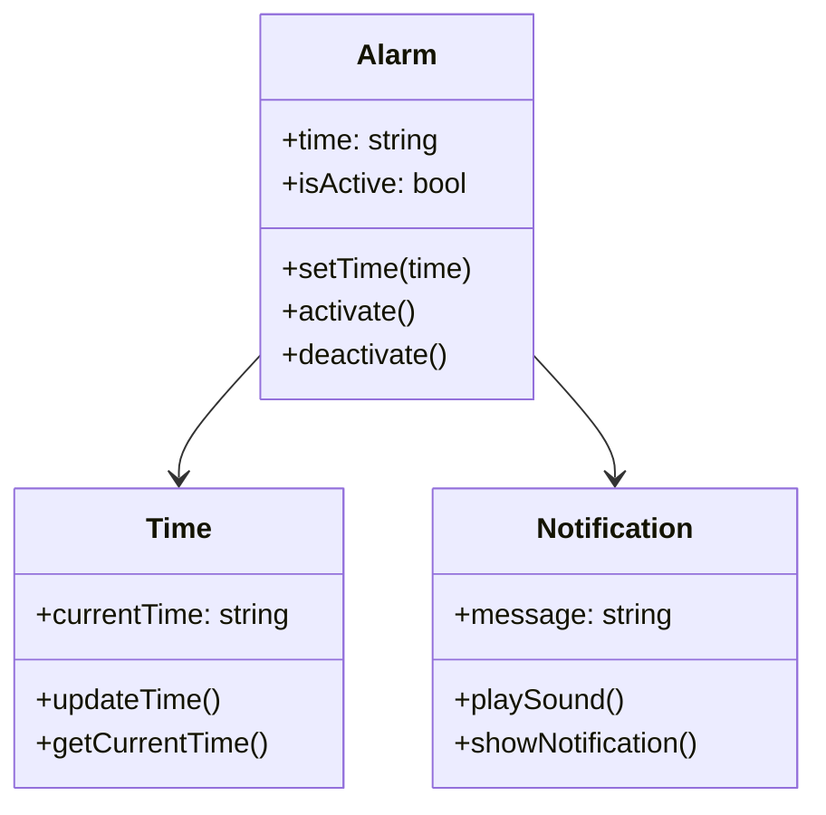
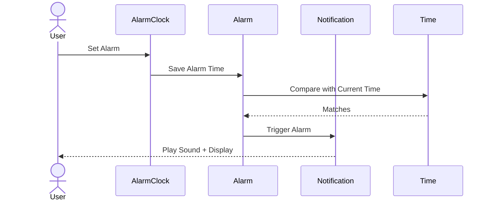
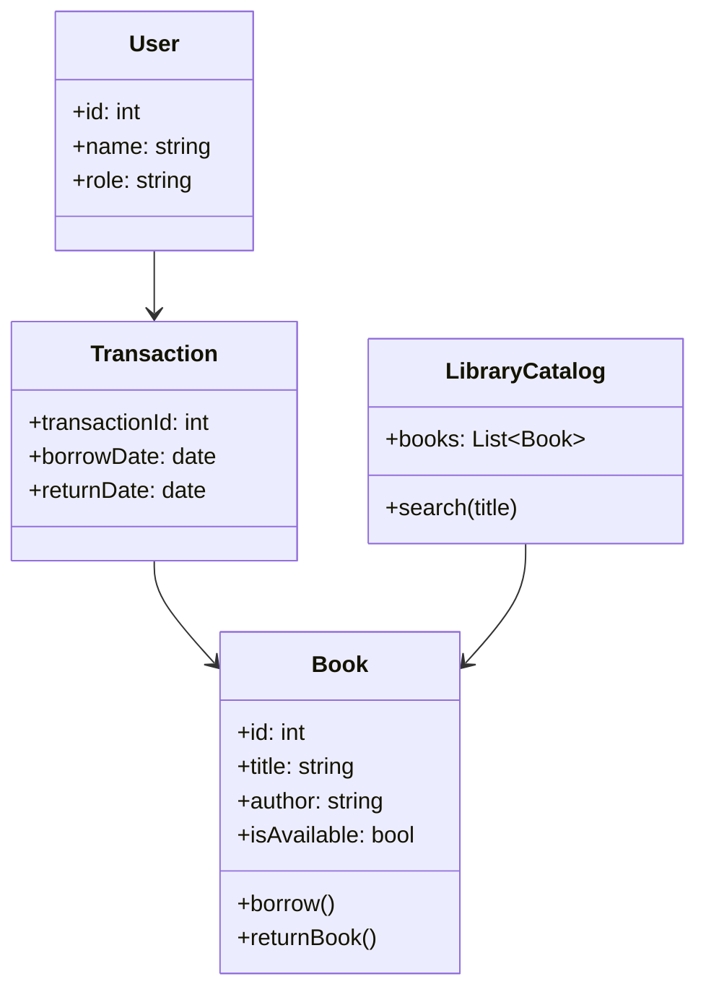
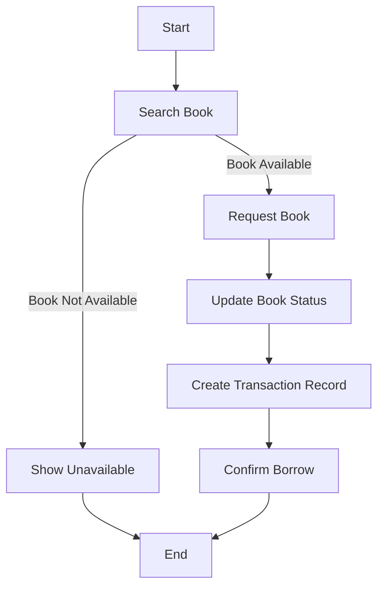
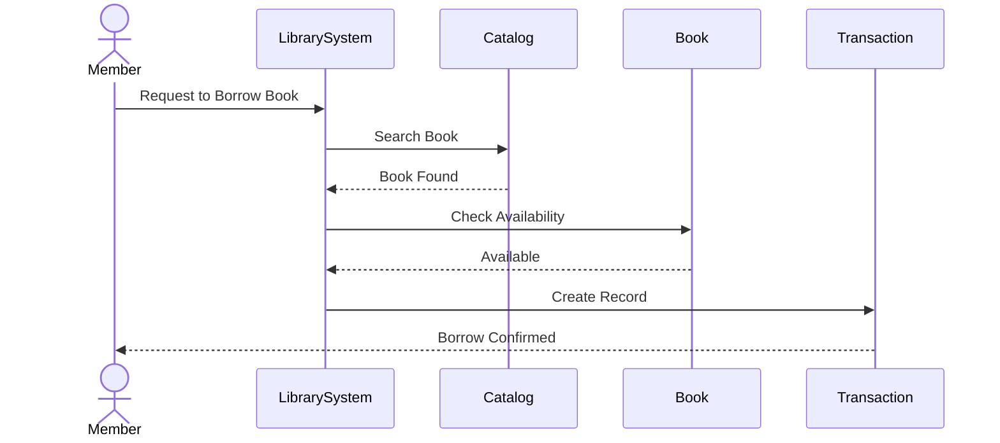
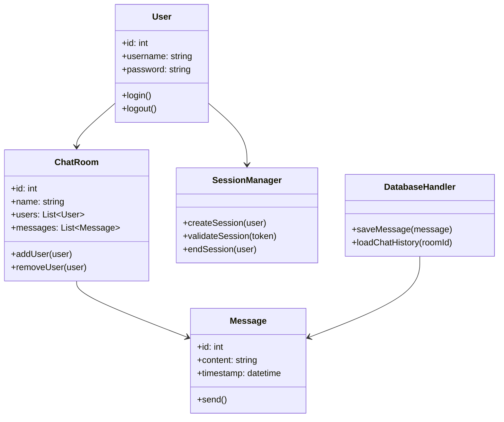
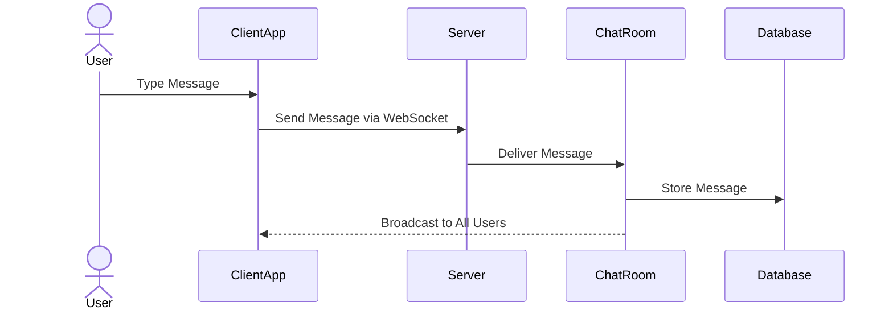
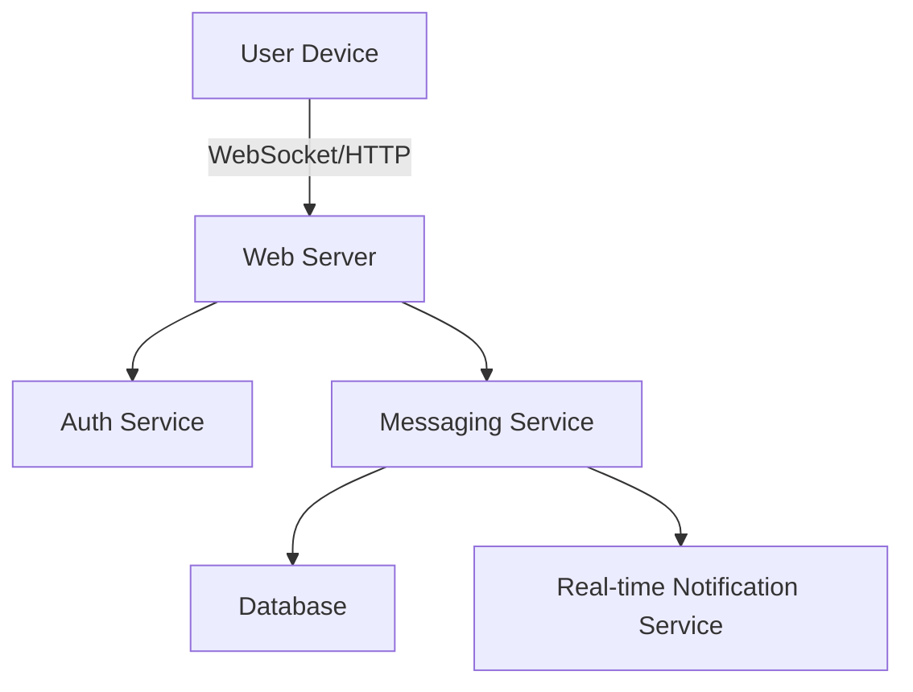
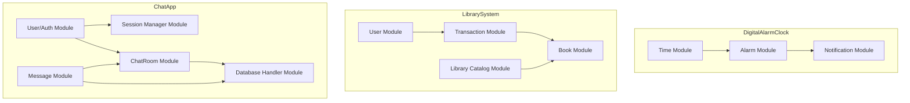

# 📝 Problem Decomposition & UML Documentation

This document contains **problem decomposition** (top-down, breakdown, modularization) for three projects at different difficulty levels, along with **UML diagrams** (Class, Sequence, Activity, Deployment) and **actor-action tables**. A final section shows **module dependencies** for all projects.

---

## 🟢 Beginner Level – Digital Alarm Clock

### Problem Decomposition

**Main Goal**: Build a digital alarm clock that displays time and rings an alarm at a set time.

**Top-Down Approach**:

* Display current time.
* Allow users to set an alarm.
* Trigger a notification when the alarm time is reached.

**Breakdown into Smaller Components**:

* **Time Management**: Track and display real-time clock updates.
* **Alarm Feature**: Set and check alarm time.
* **Notification**: Alert user with sound or visual message.

**Modularization**:

* `Time Module` – Handles current time display.
* `Alarm Module` – Stores alarm settings, triggers when matched.
* `Notification Module` – Produces alarm sound/alert.

### Actors and Actions

| Actor | Action     |
| ----- | ---------- |
| User  | Set Alarm  |
| User  | View Time  |
| User  | Stop Alarm |

### UML Diagrams

#### Class Diagram

#### Sequence Diagram

---

## 🟡 Intermediate Level – Library Book Management System

### Problem Decomposition

**Main Goal**: Manage books in a library, including borrowing and returning by users.

**Top-Down Approach**:

* Add/remove/search books.
* Borrow/return functionality.
* Track user transactions.

**Breakdown into Smaller Components**:

* **Book Management**: Add/remove books, search catalog.
* **User Transactions**: Record borrowing/returning.
* **Catalog Search**: Filter/search books by title, author, ID.

**Modularization**:

* `Book Module` – Stores details of each book.
* `User Module` – Handles member/librarian roles.
* `Transaction Module` – Records borrow/return history.
* `Library Catalog` – Provides search and availability functions.

### Actors and Actions

| Actor     | Action      |
| --------- | ----------- |
| Member    | Borrow Book |
| Member    | Return Book |
| Member    | Search Book |
| Librarian | Add Book    |
| Librarian | Remove Book |

### UML Diagrams

#### Class Diagram

#### Activity Diagram (Borrow Book)

#### Sequence Diagram

---

## 🔴 Advanced Level – Real-Time Chat Application

### Problem Decomposition

**Main Goal**: Enable multiple users to chat in real time.

**Top-Down Approach**:

* User authentication.
* Send/receive messages.
* Manage chat rooms.
* Store chat history.

**Breakdown into Smaller Components**:

* **User Authentication**: Login/logout sessions.
* **Messaging**: Send/receive, broadcast messages.
* **Chat Rooms**: Manage users and messages in groups.
* **Database**: Store chat history, retrieve past messages.

**Modularization**:

* `User Module` – Authentication and sessions.
* `Message Module` – Sending and receiving.
* `ChatRoom Module` – Group messaging logic.
* `Database Handler` – Save/load chat history.
* `Session Manager` – Manage live sessions.

### Actors and Actions

| Actor | Action            |
| ----- | ----------------- |
| User  | Login             |
| User  | Send Message      |
| User  | Join Chat Room    |
| User  | View Chat History |
| Admin | Manage Users      |
| Admin | Moderate Chats    |

### UML Diagrams

#### Class Diagram

#### Sequence Diagram (Send Message)

#### Deployment Diagram

---

## 🏗 Module Dependencies – All Projects

### ✅ Explanation

* **Digital Alarm Clock (Beginner)**

  * `Time Module` feeds `Alarm Module` which triggers the `Notification Module`.

* **Library Book Management System (Intermediate)**

  * `User Module` interacts with `Transaction Module`.
  * `Transaction Module` updates `Book Module`.
  * `Library Catalog Module` queries `Book Module` for searches.

* **Real-Time Chat Application (Advanced)**

  * `Auth Module` manages login and session info via `Session Module`.
  * `Message Module` handles sending messages to `ChatRoom Module` and persists them in `Database Module`.
  * `ChatRoom Module` coordinates message distribution and storage.

  
