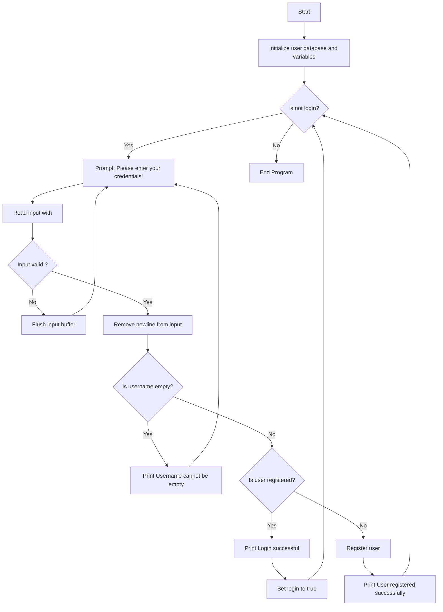

# Visualizing Logic with Flowcharts – Backend Engineering Perspective

## Introduction
Flowcharts are practical tools for visualizing the logical steps involved in processes such as logging into an application, executing algorithms, or handling backend workflows. By breaking down complex processes into simple, manageable steps, flowcharts help developers communicate logic clearly, debug effectively, and design maintainable code.

---

## Key Components of Flowcharts
Flowcharts use standard symbols to represent different parts of a process:

| Symbol    | Meaning |
|-----------|---------|
| Rectangle | Process or action (e.g., "Read input") |
| Diamond   | Decision point (e.g., yes/no, true/false) |
| Arrow     | Direction of flow |
| Oval      | Start and end points |

**Backend engineers** use these to model request handling, authentication flows, job scheduling, or service orchestration.

---

## Steps to Create Effective Flowcharts
1. **Define the process** – Identify the start, key steps, decision points, and endpoint.  
2. **Identify key steps** – Break the process into individual steps ensuring each logically follows the previous.  
3. **Draw the flowchart** – Use appropriate symbols and arrows.  
4. **Validate** – Review for missing steps, incorrect sequences, and unclear decisions.

---

## Analyzing Flowcharts for Accuracy
- **Analyze each step** – Ensure all necessary steps are included.  
- **Check decision points** – Each outcome must be clearly defined.  
- **Validate flow of control** – Arrows should correctly connect steps.  
- **Confirm start and end points** – Clearly defined beginning and ending.

---

## Common Mistakes in Flowcharting
- Missing essential steps.  
- Incorrect sequencing.  
- Ambiguous decision points.  
- Poorly defined start/end points.

---

## Flowchart Example: User Login System



**Explanation:**

* The flow starts with initializing variables and the user database.
* It checks login status, validates input, ensures the username is not empty, and either logs in the user or registers them.
* Decision points ensure proper branching for invalid inputs or unregistered users.

---

## Pseudocode 

``` bash
START

// Initialize system
Initialize registered_users array
Set user_count = 0
Set is_login = false

// Main login loop
WHILE is_login is false DO
    userName = prompt_user_for_input()

    IF NOT validate_input(userName) THEN
        flush_input_buffer()
        CONTINUE
    ENDIF

    IF is_username_empty(userName) THEN
        PRINT "Username cannot be empty."
        CONTINUE
    ENDIF

    IF is_user_registered(userName) THEN
        login_user(userName)
        Set is_login = true
    ELSE
        register_user(userName)
    ENDIF
ENDWHILE

END

// --- Function Definitions ---

FUNCTION prompt_user_for_input()
    PRINT "Please enter your credentials!"
    PRINT "Username: "
    READ userName
    RETURN userName
END FUNCTION

FUNCTION validate_input(userName)
    IF userName is empty OR input does not end with newline THEN
        RETURN false
    ELSE
        Remove newline character from userName
        RETURN true
    ENDIF
END FUNCTION

FUNCTION is_username_empty(userName)
    RETURN length of userName == 0
END FUNCTION

FUNCTION is_user_registered(userName)
    FOR each user in registered_users DO
        IF userName == user THEN
            RETURN true
        ENDIF
    ENDFOR
    RETURN false
END FUNCTION

FUNCTION login_user(userName)
    PRINT "Login successful: " + userName
END FUNCTION

FUNCTION register_user(userName)
    IF user_count < MAX_USERS THEN
        Add userName to registered_users
        Increment user_count
        PRINT "User registered successfully: " + userName
    ELSE
        PRINT "User database full!"
    ENDIF
END FUNCTION

FUNCTION flush_input_buffer()
    // Clear any remaining characters in input stream
END FUNCTION

```

---

## Backend Implementation (C Example)

```c
#include <stdio.h>
#include <string.h>
#include <stdbool.h>

#define MAX_USERS 5
#define MAX_NAME_LEN 10

char registered_users[MAX_USERS][MAX_NAME_LEN];
int user_count = 0;

bool is_user_registered(const char* userName);
bool is_username_empty(const char* userName);
bool is_input_valid(size_t len, const char* userName);
void register_user(const char* userName);
void flush_stdin();

int main(void) {
    char userName[MAX_NAME_LEN] = "";
    bool is_login = false;

    while(!is_login){
        printf("Please enter your credentials!\nUsername: ");
        if (fgets(userName, sizeof(userName), stdin) != NULL) {
            size_t len = strlen(userName);
            if (is_input_valid(len, userName)) {
                userName[len - 1] = '\0';
                if (is_username_empty(userName)){
                    printf("Username cannot be empty.\n");
                    continue;
                }
            } else {
                flush_stdin();
            }

            if (is_user_registered(userName)) {
                printf("Login successful: %s\n", userName);
                is_login = true;
            } else {
                register_user(userName);
                printf("User registered successfully: %s\n", userName);
            }
        }
    }
    return 0;
}

bool is_username_empty(const char* userName){
    return strlen(userName) == 0;
}

bool is_input_valid(size_t len, const char* userName){
    return len > 0 && userName[len - 1] == '\n';
}

void flush_stdin(){
    int ch;
    while ((ch = getchar()) != '\n' && ch != EOF);
}

bool is_user_registered(const char* userName) {
    for (int i = 0; i < user_count; i++) {
        if (strcmp(registered_users[i], userName) == 0) return true;
    }
    return false;
}

void register_user(const char* userName) {
    if (user_count < MAX_USERS) {
        strncpy(registered_users[user_count], userName, MAX_NAME_LEN - 1);
        registered_users[user_count][MAX_NAME_LEN - 1] = '\0';
        user_count++;
    } else {
        printf("User database full!\n");
    }
}
```

---

## Backend Engineering Perspective

### Applications

* Request validation and routing.
* Authentication and registration flows.
* Input validation pipelines.
* Job scheduling and service orchestration.

### Tools & Technologies

* **Visualization & design**: draw\.io, Lucidchart, Miro, Mermaid.
* **Backend frameworks**:

  * Python: FastAPI, Django REST Framework
  * Node.js: Express, NestJS
  * Java: Spring Boot
* **Testing**: Pytest, JUnit, Jest.
* **CI/CD**: GitHub Actions, GitLab CI/CD.

### Best Practices

* Always map flowcharts to **code functions** or modules for traceability.
* Include **validation and edge cases** in the flowchart.
* Use **consistent symbols** and naming conventions.
* Keep flowcharts **maintainable** as the system evolves.
* Combine flowcharting with **unit tests and BDD/TDD** to validate logic automatically.

### Recommended Books

* *Clean Code* – Robert C. Martin
* *The Pragmatic Programmer* – Andrew Hunt & David Thomas
* *Design Patterns: Elements of Reusable Object-Oriented Software* – Gamma et al.
* *Software Engineering at Google* – Titus Winters et al. (for scalable backend practices)

---

## Conclusion

Mastering flowcharts allows backend engineers to:

* Visualize processes clearly.
* Communicate logic effectively across teams.
* Reduce bugs and implementation errors.
* Ensure maintainable and scalable backend architecture.

Flowcharts bridge **conceptual design → pseudocode → actual implementation**, making them an essential tool in backend development.


