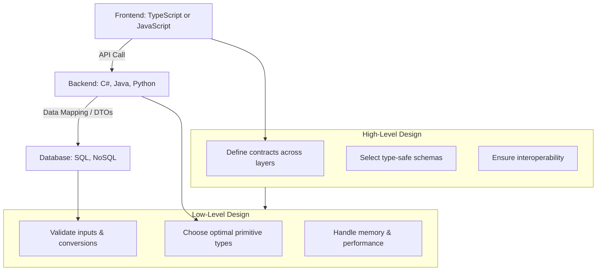

# Data Types in Software Engineering

## Introduction

This content explores essential programming concepts related to data types and their conversion. It provides a detailed overview of fundamental data types—integers, doubles, strings, and booleans—explaining their characteristics and uses in programming. The content also guides learners on identifying, categorizing, and converting data types using various methods and practical examples in C#, ensuring effective data manipulation and error-free code execution.

As a software engineer, understanding data types goes beyond syntax—it’s about **system design**, **efficiency**, and **reliability**, both at **compile time** and **runtime**.

---

## Fundamental Data Types

* **Integer** → whole numbers (e.g., user ID, order quantity).
* **Double/Float** → decimal values (e.g., prices, coordinates).
* **String** → sequences of characters (e.g., names, messages).
* **Boolean** → logical truth values (e.g., isActive, hasPermission).

Each choice affects **memory usage**, **performance**, and **data integrity** across applications.

---

## Identification and Categorization of Data Types

The process of identifying data types involves using programming functions like `GetType()` in C# to determine a variable's type.

* **Reflection / Introspection** → e.g., `GetType()` in C#, `typeof` in TypeScript, or `type()` in Python.
* **Compatibility Checks** → ensuring type consistency in operations (adding integers vs. concatenating strings).
* **Validation Functions** → e.g., `int.Parse()`, `TryParse()`, or JSON schema validation.

Correct identification prevents **type mismatch errors** that can cause runtime failures.

---

## Data Type Conversion

Conversion methods include casting (explicitly converting a type), parsing (interpreting strings as other data types), implicit conversion (automatic conversion by the language), and explicit conversion (requiring a function or method).

* **Implicit Conversion** (safe, automatic by compiler) → int → double.
* **Explicit Conversion** (casting, requires developer) → double → int.
* **Parsing** (string interpretation) → `"123"` → int.
* **Serialization/Deserialization** → object → JSON → object.

These conversions are critical in **fullstack applications**, where data often flows across layers (frontend → backend → database → external API).

---

# High-Level Design (HLD) Perspective

From an **HLD** point of view, choosing data types is about **system-wide correctness** and **interoperability**:

1. **Type-Safe Languages (e.g., Java, C#, Go, Rust):**

   * Pros: Early error detection (compile-time), strict contracts, safer API boundaries.
   * Cons: More verbose, requires careful upfront design.
   * Example: Defining DTOs in a C# backend ensures frontend (TypeScript) matches expected types.

2. **Non-Type-Safe Languages (e.g., Python, JavaScript, PHP):**

   * Pros: Faster prototyping, flexible with dynamic data.
   * Cons: Errors appear at runtime, higher risk of type mismatches.
   * Example: JavaScript function might accept `"5"` instead of `5`, causing subtle bugs.

3. **HLD Decision Factors:**

   * **Scalability**: Large systems benefit from type-safe contracts.
   * **Interoperability**: When APIs cross language boundaries, serialization/deserialization rules must be enforced.
   * **Domain Modeling**: Using appropriate data types to represent **business logic** (e.g., `Money` class instead of raw `double`).

---

# Low-Level Design (LLD) Perspective

From an **LLD** point of view, data types affect **memory layout, performance, and error handling**:

1. **Type-Safe Languages:**

   * Compiler enforces strict rules.
   * Memory allocation predictable.
   * Nullability and overflow checks improve stability.
   * Example: In C#, `decimal` is chosen for financial calculations to avoid floating-point precision errors.

2. **Non-Type-Safe Languages:**

   * Runtime must infer types, adding overhead.
   * Requires **manual validation** (e.g., `isinstance()` in Python).
   * Easy to introduce bugs (e.g., `"10" + 5` → `"105"` in JavaScript).

3. **LLD Best Practices:**

   * Always **validate inputs** before operations (e.g., API request payloads).
   * Use **domain-specific value objects** to wrap primitives (e.g., `Email`, `UserID`, `Money`).
   * Prefer **immutable types** for concurrency safety.
   * Choose the **smallest suitable type** (e.g., `int16` instead of `int64` when appropriate) to save memory.

---

# Compile-Time vs. Run-Time Data Type Handling

1. **Compile-Time (Type-Safe Languages):**

   * Compiler ensures correctness.
   * Errors caught early, reducing runtime bugs.
   * IDEs provide better **autocomplete and refactoring support**.

2. **Run-Time (Dynamic Languages):**

   * Flexibility: data structures adapt easily.
   * Requires runtime guards (`try/except`, `typeof`, `instanceof`).
   * Errors appear in production if not carefully tested.

---

# Diagram: HLD vs LLD in Fullstack Data Type Design

---

# Recommended Books & Resources

### **Data Types & Programming Concepts**

* *Types and Programming Languages* by Benjamin C. Pierce (deep dive into type systems).
* *Programming Language Pragmatics* by Michael L. Scott (great for both compile-time and runtime concepts).
* *Concepts of Programming Languages* by Robert W. Sebesta (introductory + practical).

### **Software Engineering & System Design**

* *Domain-Driven Design: Tackling Complexity in the Heart of Software* by Eric Evans (on modeling data types as business objects).
* *Clean Code* by Robert C. Martin (on using meaningful types to improve clarity).
* *Designing Data-Intensive Applications* by Martin Kleppmann (runtime data management at scale).

### **Fullstack-Specific Knowledge**

* *You Don’t Know JS (Yet)* by Kyle Simpson (deep insights into JavaScript’s dynamic typing).
* *C# in Depth* by Jon Skeet (advanced type safety in backend development).
* *Effective TypeScript* by Dan Vanderkam (bridging compile-time types with JS runtime).

---

## Conclusion

Understanding data types and their conversions is crucial for ensuring that data is correctly processed and operations are performed accurately in programming. Mastery of these concepts helps reduce bugs and increases the reliability of code.

At **HLD**, data types enforce contracts across system layers (frontend ↔ backend ↔ DB).
At **LLD**, they dictate **memory safety, error handling, and efficiency**.

* Type-safe languages catch mistakes early but require upfront design.
* Non-type-safe languages allow flexibility but demand **rigorous testing and validation**.
