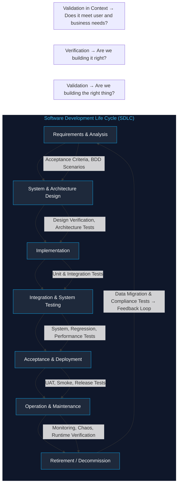

# 🧩 The Software Test: A Systems Engineering Perspective

## 1. What is a “Test” — Beyond the Code

At its core, a **test** is an **experiment** designed to *verify and validate* software behavior against defined expectations.

A test case always contains four conceptual components:

| Component               | Description                                                                                           |
| ----------------------- | ----------------------------------------------------------------------------------------------------- |
| **Setup**               | Preparing the system to a known, valid state (e.g., authenticated session, seeded database).          |
| **Invocation**          | Executing the code or process under test with specific **inputs** (test data).                        |
| **Assessment (Oracle)** | Comparing the **actual output** or behavior with the **expected result** — manually or automatically. |
| **Teardown**            | Cleaning up any side effects (e.g., closing connections, removing test data).                         |

A complete **test case** is not just “run code and see what happens”; it’s a *miniature scientific experiment* — controlled inputs, observable outcomes, and a pass/fail judgment.

---

## 2. The Broader Definition

From an engineering perspective:

> **A test is a controlled observation or experiment conducted to gain confidence in a system’s correctness, performance, or resilience.**

Thus, a test can target:

* **Functional correctness** (Does it do what it should?)
* **Non-functional qualities** (How fast, secure, scalable, usable?)
* **Integration and systemic behaviors** (Does it play well with others?)
* **Operational stability** (Does it survive chaos?)

---

## 3. Why Tests Matter Across the SDLC

Testing is not a “phase” — it’s a **continuous discipline** that supports *every* activity in the lifecycle.

Below we’ll walk through each SDLC stage and show how testing manifests differently — from abstract design validation to runtime verification.

---

# 🧭 Tests Throughout the SDLC

| SDLC Phase                          | Testing Focus                                            | Typical Artifacts                                                    | Tools / Techniques                                                          | Strategic Purpose                                                                 |
| ----------------------------------- | -------------------------------------------------------- | -------------------------------------------------------------------- | --------------------------------------------------------------------------- | --------------------------------------------------------------------------------- |
| **1. Requirements & Analysis**      | *Validation* — Are we building the right thing?          | User acceptance criteria, business rules, testable requirements      | Behavior-Driven Development (BDD), acceptance tests, prototypes             | Ensures clarity and measurability of user needs                                   |
| **2. System & Architecture Design** | *Verification of design integrity*                       | Design review checklists, architectural simulations, threat modeling | Architecture test cases, load simulations, model verification               | Confirms that design decisions can meet NFRs (performance, scalability, security) |
| **3. Implementation (Coding)**      | *Unit & Integration testing* — Are we building it right? | Unit test suites, mocks, stubs, code coverage reports                | xUnit frameworks (JUnit, PyTest, NUnit, etc.)                               | Ensures components work correctly in isolation and with peers                     |
| **4. Integration & System Testing** | *Behavioral & interface testing*                         | Integration test suites, API contracts, E2E workflows                | API testing (Postman, pytest-httpx), contract testing (Pact), UI automation | Validates full workflows and inter-service communication                          |
| **5. Acceptance & Deployment**      | *Validation against business goals*                      | User acceptance tests (UAT), smoke tests                             | Selenium, Cucumber, Robot Framework, Playwright                             | Confirms product satisfies stakeholder expectations                               |
| **6. Operation & Maintenance**      | *Regression, Monitoring, and Runtime Verification*       | Regression test suites, monitoring alerts, canary tests              | Prometheus, Grafana, Chaos Monkey, A/B testing                              | Ensures stability, detects regressions and runtime anomalies                      |
| **7. Retirement / Decommission**    | *Decommission tests*                                     | Data migration validation, archival verification                     | Custom scripts, audit tests                                                 | Guarantees safe and compliant system sunset                                       |

---

## 4. The Lifecycle Flow of Testing Intent

Testing evolves alongside the SDLC.
Each phase of development carries a **specific intent** — from validating needs and verifying structure to ensuring operational integrity.
This flow represents how **testing intent matures** as software moves from concept to reality.

---

### 🧩 Visualization: Testing Intent Flow Across the SDLC

---

### 🧠 Understanding the Flow

| SDLC Phase                    | Testing Intent                  | Key Question                                  |
| ----------------------------- | ------------------------------- | --------------------------------------------- |
| **Requirements & Analysis**   | **Validation of purpose**       | Are we building the right thing?              |
| **Architecture & Design**     | **Verification of feasibility** | Can this design satisfy non-functional goals? |
| **Implementation**            | **Verification of correctness** | Does each component behave as intended?       |
| **Integration & System**      | **Validation of behavior**      | Do parts work together as expected?           |
| **Acceptance & Deployment**   | **Validation of readiness**     | Is the product ready for users?               |
| **Operation & Maintenance**   | **Verification of reliability** | Does it stay correct under real conditions?   |
| **Retirement / Decommission** | **Validation of closure**       | Is the system safely retired and compliant?   |

---

### ⚙️ The Three Layers of Testing Intent

1. **Validation (Requirements Layer)**
   Focus: defining *what* to build.
   Techniques: user acceptance criteria, BDD scenarios, prototypes.
   Output: shared understanding of user needs.

2. **Verification (Design & Implementation Layer)**
   Focus: ensuring *how* we build it meets technical expectations.
   Techniques: unit, integration, architecture, and performance testing.
   Output: technical correctness and system coherence.

3. **Validation in Context (Operational Layer)**
   Focus: ensuring continued *value* and *stability* after release.
   Techniques: runtime verification, chaos testing, observability.
   Output: sustained reliability and feedback into next iterations.

---

### 🔁 Continuous Feedback Loop

The **feedback arrow (G → A)** illustrates a crucial principle of modern engineering:
testing doesn’t end when the product ships — it informs the *next cycle of requirements*.

* Failures and incidents feed back into better design constraints.
* User telemetry feeds back into usability and business alignment.
* Monitoring data drives preventive testing for future releases.

Testing is therefore a **continuous quality feedback mechanism** rather than a terminal activity.

---

## 5. Types of Tests in Context

| Test Type            | SDLC Stage                   | Scope                 | Example                                      |
| -------------------- | ---------------------------- | --------------------- | -------------------------------------------- |
| **Unit Test**        | Implementation               | Single function/class | `assert calculate_tax(100) == 10`            |
| **Integration Test** | Implementation / Integration | Multiple components   | Database + API interaction                   |
| **System Test**      | System testing               | Full system           | Simulate a user purchasing an item           |
| **Acceptance Test**  | Deployment                   | Business flow         | End-user scenario using acceptance criteria  |
| **Performance Test** | Design / System              | Non-functional        | Stress, load, soak, spike tests              |
| **Security Test**    | Design / Operation           | Vulnerabilities       | Pen testing, fuzzing, threat modeling        |
| **Regression Test**  | Maintenance                  | Entire codebase       | Run test suite after each change             |
| **Exploratory Test** | Early / Late                 | Human intuition       | Freeform testing for unanticipated issues    |
| **Chaos Test**       | Operation                    | Availability          | Netflix Chaos Monkey randomly kills services |

---

## 6. The Oracle Problem and Automation Impact

The **Oracle** — the mechanism that decides whether a test passes — has evolved through three main forms:

* **Manual Oracles** rely on human judgment (useful for exploratory and usability testing).
* **Automated Oracles** use assertions in frameworks like PyTest, JUnit, and Cucumber.
* **Heuristic or Statistical Oracles** apply to systems with probabilistic outputs, such as AI models.

Combined with **CI/CD pipelines**, automated oracles make **continuous testing** practical — bugs surface within minutes of introduction, not during post-release firefights.

---

## 7. Strategic Integration in Modern Pipelines

In a modern backend or distributed system:

* **CI pipelines** run **unit tests, linters, and static analysis**.
* **Pre-deployment** environments run **integration, contract, and smoke tests**.
* **Production monitoring** enables **synthetic and runtime verification**.
* **Feature toggles and canary deployments** allow incremental rollout and A/B validation.

Testing thus becomes an **autonomic function** — constantly observing, reacting, and adjusting the system’s health.

---

## 8. Architectural Impacts of a Testing Culture

Designing for testability changes how systems are architected:

| Principle         | Architectural Practice                                       |
| ----------------- | ------------------------------------------------------------ |
| **Testability**   | Loose coupling and clear interfaces enable isolated testing. |
| **Repeatability** | Deterministic data, mocks, and consistent environments.      |
| **Observability** | Logs, metrics, and tracing integrated from the start.        |
| **Isolation**     | Containerized test environments and mock dependencies.       |
| **Automation**    | Pipelines orchestrate tests continuously, not manually.      |

Testing disciplines therefore *drive architectural quality* — ensuring modularity, maintainability, and resilience.

---

## 9. Applying It All Together: Example SDLC Map

Example for a **FastAPI + PostgreSQL** backend system:

| Phase                 | Key Testing Activities                                                             |
| --------------------- | ---------------------------------------------------------------------------------- |
| **Planning**          | Define measurable acceptance criteria and performance SLAs.                        |
| **Design**            | Verify schema migrations, API contracts, and component boundaries.                 |
| **Implementation**    | Apply unit and integration testing using Pytest and async SQLModel mocks.          |
| **Integration**       | Run E2E API tests in Dockerized environments; validate transaction consistency.    |
| **System Validation** | Perform load testing with Locust and resilience testing under concurrent users.    |
| **Deployment**        | Execute smoke and canary tests post-deployment; automate rollback on failure.      |
| **Maintenance**       | Run regression suites and runtime monitoring; expand tests as new features evolve. |

---

## 🧠 Summary: Testing as an Architectural Discipline

| Role of Testing            | Description                                                                   |
| -------------------------- | ----------------------------------------------------------------------------- |
| **As a Design Driver**     | Encourages modular, observable, and predictable system architectures.         |
| **As a Feedback System**   | Provides continuous visibility into correctness, performance, and user value. |
| **As a Cultural Practice** | Promotes engineering confidence, accountability, and agility.                 |

> **A well-tested system isn’t just correct — it’s *knowably* correct.**
